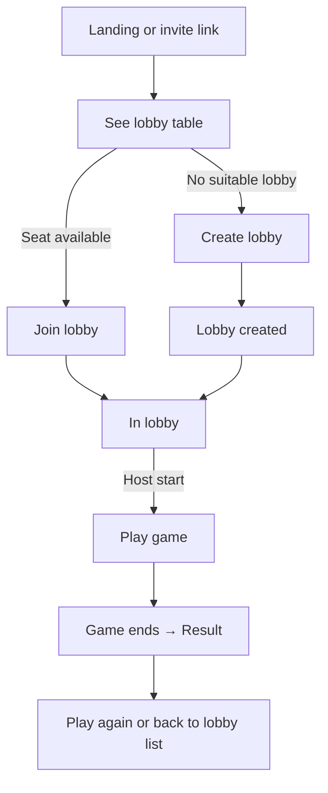
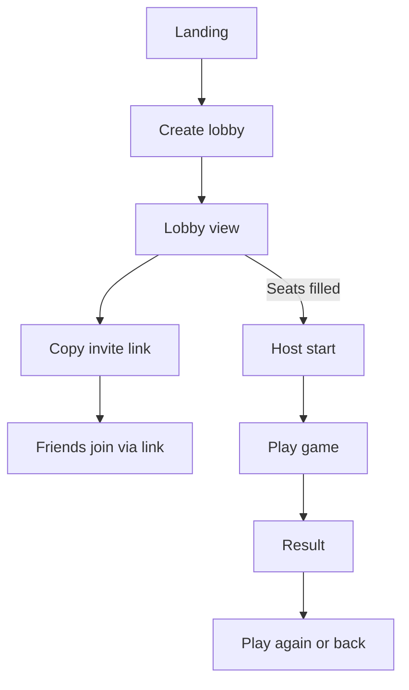
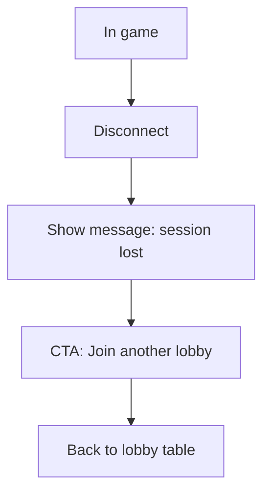

# UX Design Specification {{project_name}}

**Author:** {{user_name}}
**Date:** {{date}}

---

<!-- UX design content will be appended sequentially through collaborative workflow steps -->

## Executive Summary

### Project Vision
Forever-free, instant-play web board-game platform (Connect4/Checkers MVP) with 2–4 minute signup-to-play, fast lobby discovery/hosting, and rules-enforced games via shareable URLs on desktop/mobile.

### Target Users
Casual drop-in players (12–80, ~1x/week, <1h sessions); hosts creating quick tables; future indie publishers (post-MVP).

### Key Design Challenges
- Achieve 2–4 minute landing→seat flow.
- Keep lobby liquidity visible; fast join/create paths.
- Communicate disconnect/no-reconnect clearly; enable fast rejoin.

### Design Opportunities
- Invite deep-links and per-session URLs to cut friction.
- Lean responsive MPA pages for game pick → lobby → play.
- Minimal host controls (start/end/kick) for speed and clarity.

## Core User Experience

### Defining Experience
- Core loop: land → see open lobbies (game displayed) → join a lobby or create one → start play within 2–4 minutes.
- MVP games: Connect4, Checkers; rules-enforced, authoritative play.

### Platform Strategy
- Web MPA, desktop/mobile browsers; touch + mouse; no offline.
- Shareable lobby/session URLs for invites and direct load.

### Effortless Interactions
- Invite deep-links open the target lobby context.
- Auto-join an open lobby when a seat exists; clear path to create a lobby if none.
- Host controls (start/end/kick) are obvious and minimal.
- Disconnect: clear notice + one-tap “join new lobby” (no reconnect in MVP).

### Critical Success Moments
- First seat within 2–4 minutes from landing.
- First move accepted; illegal move rejected with reason.
- Game ends with clear result screen.
- Disconnect handled without the user feeling stuck.

### Experience Principles
- Speed to seat.
- Clarity over options.
- Link-first navigation and sharing.
- Fail forward on disconnects.

## Desired Emotional Response

### Primary Emotional Goals
- Feel welcome, light, and confident they can play now without paying.

### Emotional Journey Mapping
- Landing: curious → confident it’s free/fast.
- Join/Create: eager, in control; no payment friction.
- In-game: focused, fair (rules enforced, illegal moves explained).
- End: satisfied/completed.
- Error/Disconnect: informed, not stuck; quick rejoin path.

### Micro-Emotions
- Confidence, fairness, sociability, calm; avoid frustration, confusion, emptiness.

### Design Implications
- Explicit “free/instant” cues; minimal fields.
- Clear lobby status/seats; auto-join default, create-lobby fallback.
- Friendly, specific move/permission errors.
- Disconnect notice + one-tap “join another lobby.”
- Simple invite/link flows that feel social.

### Emotional Design Principles
- Trust through clarity.
- Speed reduces anxiety.
- Fairness is surfaced (rules feedback).
- Always a way forward after errors.

## UX Pattern Analysis & Inspiration

### Inspiring Products Analysis
- Board Game Arena: clear lobby list and per-game context cues.
- Discord/Slack: frictionless invite-link joins.
- Duolingo: minimal “just start” onboarding, fast path to action.

### Transferable UX Patterns
- Shareable per-session links with deep-link to the correct lobby.
- Lobby cards showing game + seats; auto-join by default with clear “create lobby.”
- Minimal-field onboarding; progressive disclosure.
- Clear, friendly feedback for errors/illegal moves.

### Anti-Patterns to Avoid
- Paywalls/ads before play.
- Empty lobby with no guidance or CTA.
- Ambiguous disconnect/error states.

### Design Inspiration Strategy
- Adopt link-first join patterns and concise lobby cards.
- Adapt “just start” onboarding to hit 2–4 minute goal.
- Avoid monetization prompts and cluttered overlays in MVP; keep focus on instant play.

## Design System Foundation

### 1.1 Design System Choice
- Tailwind-style utility-first with headless UI primitives for controls/overlays.

### Rationale for Selection
- Optimized for speed and small team; easy responsive behavior; minimal bloat; supports friendly, clear aesthetic without heavy theming overhead.

### Implementation Approach
- Utility classes for layout/spacing/typography; headless components for dialogs, lists, menus, toasts; keep page bundles small; ensure touch + mouse states.

### Customization Strategy
- Define basic tokens (color, spacing, radius, typography); light, clean theme; minimal motion; can layer brand tweaks later without rework.

## 2. Core User Experience

### 2.1 Defining Experience
- Defining interaction: land → view lobby list (game shown) → join or create lobby → start play within 2–4 minutes.
- MVP games: Connect4 and Checkers; rules enforced; invite links deep-link to lobby.

### 2.2 User Mental Model
- Users expect “click a link, join a table” like BGA/Discord invites; no payments or long forms.
- Lobby list should feel like a room list: seats visible, game clear, quick join; creating a table is a known pattern.

### 2.3 Success Criteria
- Seat secured within 2–4 minutes from landing.
- First move accepted; illegal moves rejected with reason.
- Clear end-of-game result; user knows they finished.
- On disconnect, user isn’t stuck and can quickly join another lobby.

### 2.4 Novel UX Patterns
- Mostly established patterns (lobby list, join/create, invite deep-link); novelty is emphasizing “free + instant” with minimal friction.

### 2.5 Experience Mechanics
- Initiation: arrive via link or landing; see lobbies immediately; CTA to join or create.
- Interaction: auto-join if seat available; otherwise create lobby with minimal fields; host start/end; moves validated.
- Feedback: lobby/join success state; errors explain (illegal move, full lobby); disconnect notice with “join another lobby.”
- Completion: game result screen; option to play again or return to lobby list.

## Visual Design Foundation

### Color System
- Primary: #2563EB (blue-600), hover #1D4ED8; light tint #EFF6FF.
- Secondary: #14B8A6 (teal-500); light tint #ECFEFF.
- Neutral: #0F172A (text), #334155 (subtext), #E2E8F0 (borders/dividers), #F8FAFC (background).
- Feedback: Success #16A34A; Warning #F59E0B; Error #DC2626.

### Typography System
- Face: Inter (or system fallback) for clarity/speed.
- Scale: h1 36/44, h2 30/38, h3 24/32, h4 20/28, body 16/24; body line-height ~1.5.

### Spacing & Layout Foundation
- 8px base spacing grid; airy but compact controls.
- Mobile-first responsive; cards for lobby list; 12-column desktop grid, single-column mobile.

### Accessibility Considerations
- Aim for 4.5:1 contrast for text on backgrounds; button text on primary meets contrast; minimal motion.

## Design Direction Decision

### Design Directions Explored
- Focus on a light, clear layout with lobby list as a table (not cards), minimal chrome, link-first navigation.

### Chosen Direction
- “Light table” direction: lobby list presented as a table with columns (Game, Seats, Status/Players, Action), primary blue CTAs for Join/Create, teal accents for success, top bar plus main content, no side nav.

### Design Rationale
- Emphasizes readability of lobby data and fast scanning; aligns with “free/instant/clear”; keeps visual noise low while prioritizing join speed and clarity.

### Implementation Approach
- Tailwind + headless components; responsive table that stacks on mobile; primary/secondary buttons; top bar with invite/create CTA; light theme using defined tokens.

## User Journey Flows

### Landing / Invite → Join Lobby → Play


### Landing → Create Lobby → Invite → Start


### Disconnect Edge


### Journey Patterns
- Link-first entry, immediate lobby table.
- Auto-join when seats exist; clear create path otherwise.
- Host controls start/end; invite flows from lobby.
- Disconnects fail forward to lobby table.

### Flow Optimization Principles
- Minimize steps to seat (2–4 minutes goal).
- Keep choices simple: Join vs Create.
- Always provide a forward path after errors/disconnects.
- Surface game/seat info upfront; inline feedback for errors.
```

## Component Strategy

### Design System Components
- Use utility-first + headless primitives for buttons, inputs, modal/dialog, table, tabs, toasts, menus.

### Custom Components
- **Lobby Table**: Columns (Game, Seats, Status/Players, Action). States: default, loading, empty, full. Responsive stacking on mobile. Optional sort/filter later.
- **Lobby Row Action**: Primary Join; secondary Create/disabled when full; host controls visible when you own the lobby.
- **Create Lobby Modal**: Fields: game (default Connect4/Checkers), seats, visibility (optional). Actions: Create/Cancel. Validation/error states.
- **Invite Banner/Toast**: After lobby creation, copy-link CTA with confirmation.
- **Disconnect Notice**: Inline/modal message “session lost” + CTA “Join another lobby.”
- **Game Board Shell**: Hosts Connect4/Checkers board, turn indicator, move feedback, result state; header with back/exit.

### Component Implementation Strategy
- Build custom components atop design tokens; keep variants minimal. Ensure responsive behavior and keyboard/focus states.

### Implementation Roadmap
- Phase 1: Lobby Table; Create Lobby Modal; Invite Banner/Toast; Disconnect Notice; Game Board Shell.
- Phase 2: Table filters/sort; host kick refinement; richer result screen.
- Phase 3: Additional game-specific shells/components.

## UX Consistency Patterns

### Button Hierarchy
- Primary: solid blue (#2563EB) for main actions (Join, Create).
- Secondary: outline/ghost for secondary actions (Create when secondary, Cancel).
- Destructive: red for kick/end session when applicable.

### Feedback Patterns
- Banners/toasts: Success teal, Error red, Warning amber, Info blue.
- Inline errors under fields; illegal moves/messages inline in game area.
- Toasts for transient events (e.g., invite copied).

### Form Patterns
- Minimal fields; labels + helper text; inline validation; required marked.
- Enter-to-submit where safe; clear error messaging.

### Navigation Patterns
- Top bar with brand + account; main area for lobby table or game view.
- Deep-link friendly: lobby/session URLs land in correct context.

### Additional Patterns
- Empty state: friendly message + primary “Create lobby.”
- Loading: skeleton rows for lobby table; spinner for modal submit.
- Error/disconnect: modal/banner with clear action to return to lobby list.

## Responsive Design & Accessibility

### Responsive Strategy
- Mobile-first; single-column on small screens; lobby table stacks rows (Game/Seats/Status/Action); top bar collapses to simple header/menu; game view stacks with persistent turn indicator.

### Breakpoint Strategy
- Mobile <768px; Tablet 768–1023px; Desktop ≥1024px; mobile-first media queries.

### Accessibility Strategy
- Target WCAG 2.1 AA basics: contrast 4.5:1 text; visible focus; keyboard operable dialogs/tables; ARIA labels for buttons/links; touch targets ≥44px. No advanced a11y beyond basics for MVP.

### Testing Strategy
- Real devices (iOS/Android); desktop Chrome/Firefox/Safari; keyboard-only checks; screen reader smoke (VoiceOver/NVDA); automated a11y linting; responsive snapshots.

### Implementation Guidelines
- Semantic HTML; mobile-first CSS with relative units; manage focus for modals; skip-to-content; aria-live/toasts for system messages; optimize assets for mobile.
